# Brandign, Design & Integration: La Fabrique - Boulangerie et Pâtisserie

_August - October 2022_

> 🔨 Branding, Design and integration of a fictional bakery and pastry. The design has been made using Figma and Adobe Illustrator during my Web-design training at Sirius School. I also used the 3D software [VROID](https://vroid.com/en) and Adobe Photoshop for some artworks. Integration uses HTML, CSS3 and JS (no framework).

---

The website is responsive and slider/swiper, sticky menu and burger menu are working.

Result can be seen here on the [Github Page](https://raigyo.github.io/webdesign-integration-la-fabrique/)

## Moodboard

_A mood board is a collage or composition of images, visuals and other objects, often created for the purposes of design or presentation. Mood boards can help designers to figure out how to create unified styles or themes for a design project._

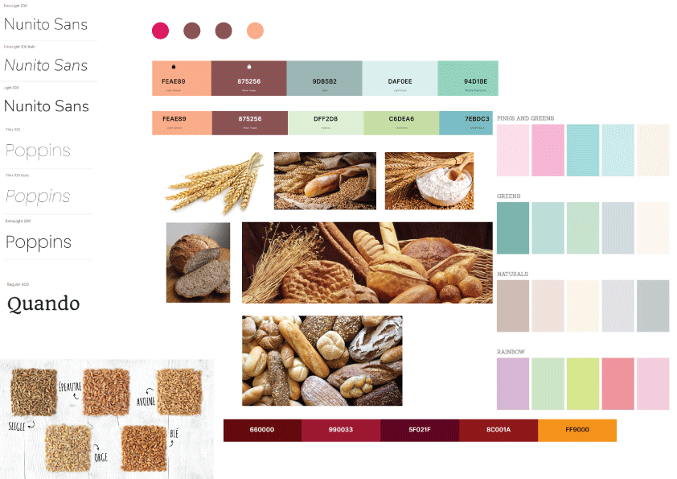

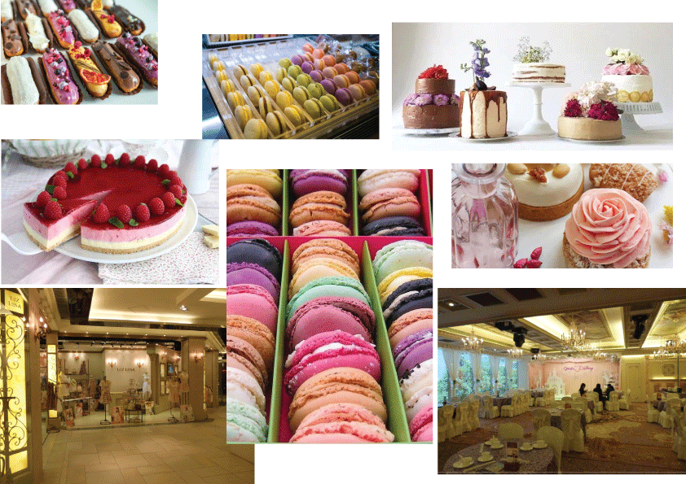

## Branding and concepts

   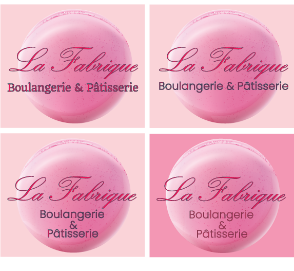

   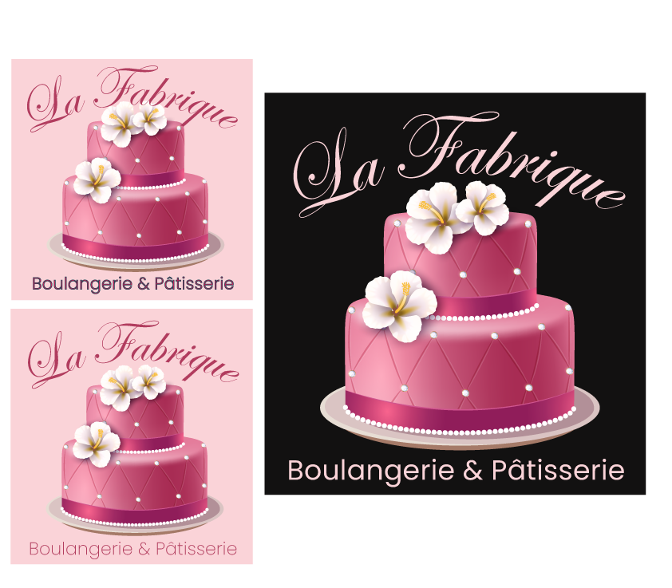

   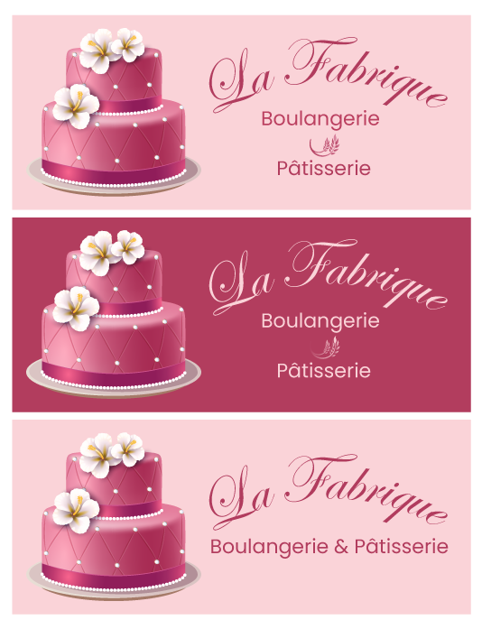

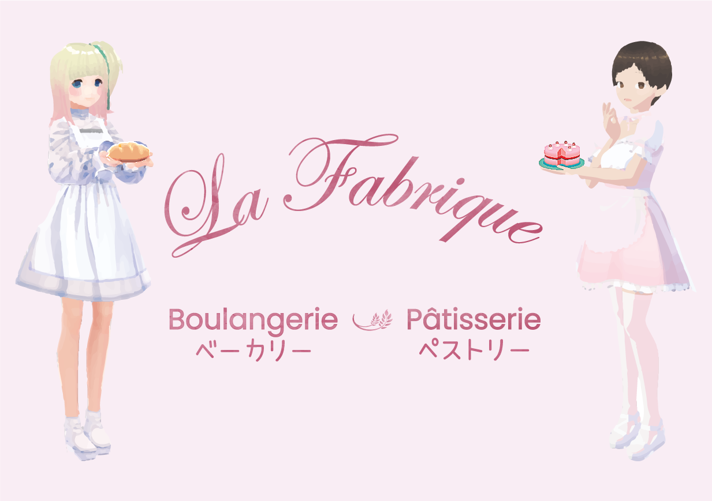

   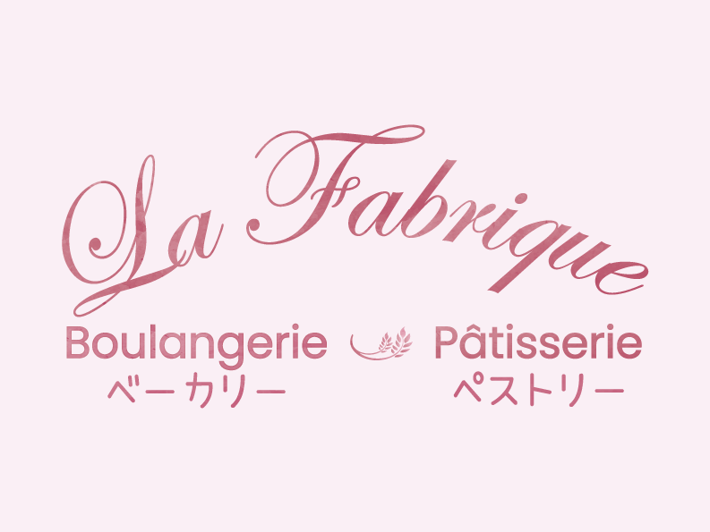

   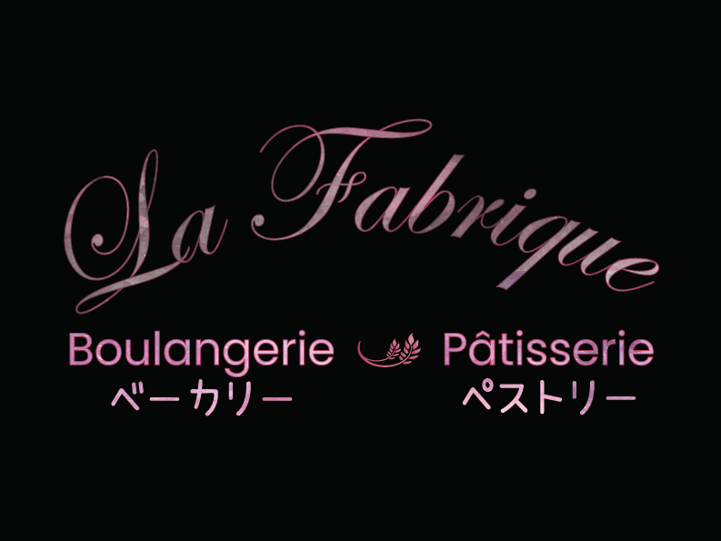

   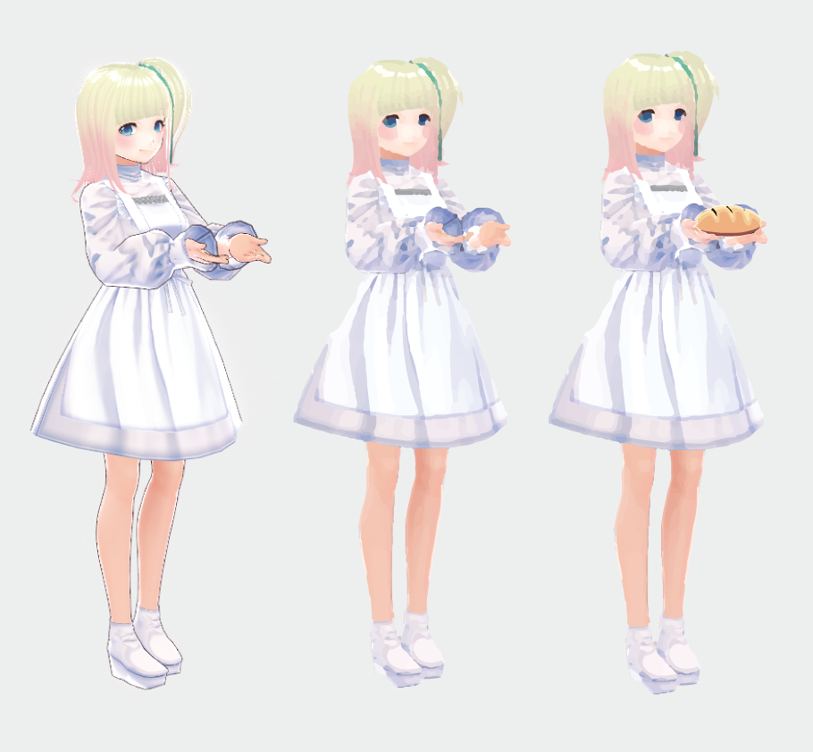

## Wireframes

_A wireframe is a two-dimensional illustration of a page's interface that specifically focuses on space allocation and prioritization of content, functionalities available, and intended behaviors._

Figma file (.fig): [Download](_sources/Wireframe boulangerie.fig)

   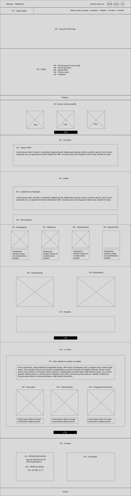

## Figma project

Figma file (.fig): [Download](\_sources/La Fabrique.fig)

### Homepage

   

### Sticky menu

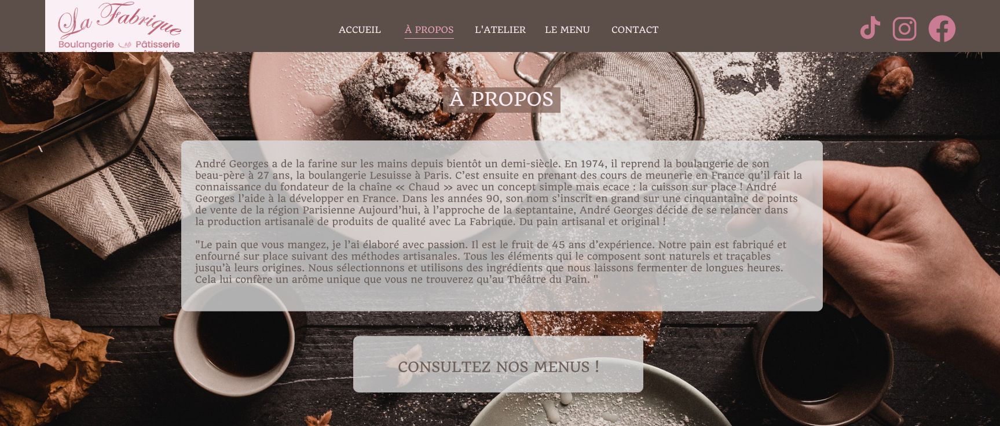

### Slider

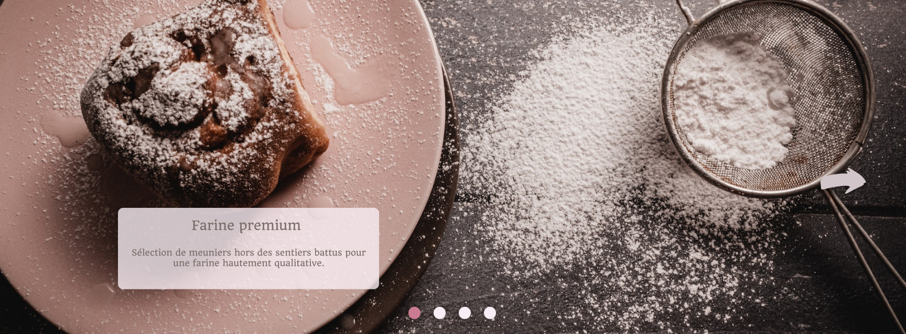

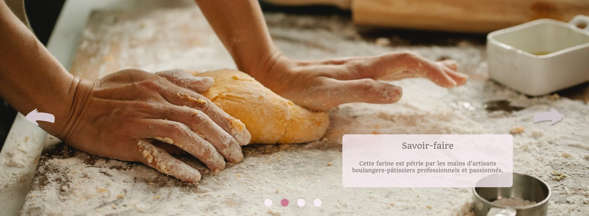

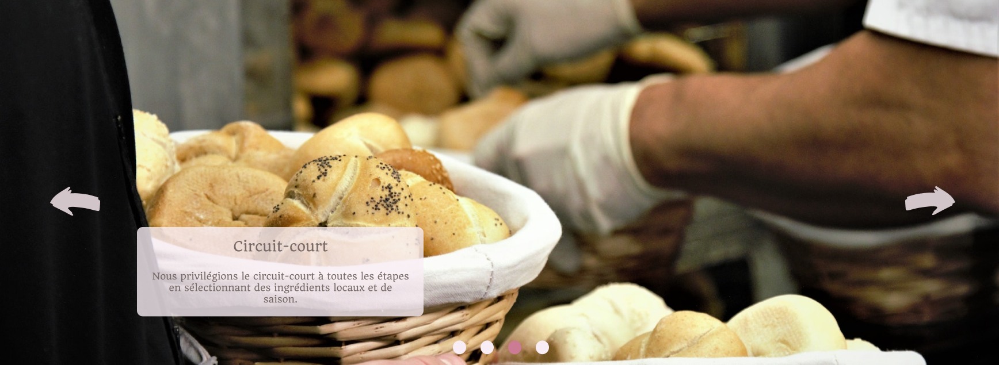

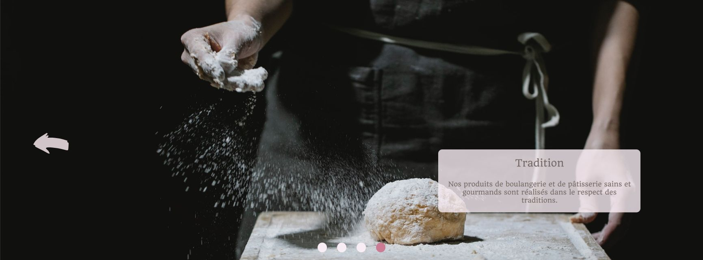

### Charter for front-end developer

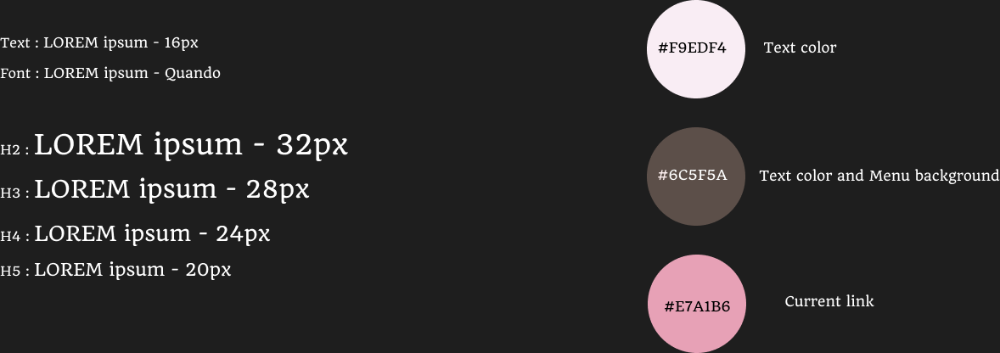

## Integration

### Integration process (Grid displayed using dev tools)

### Final result desktop

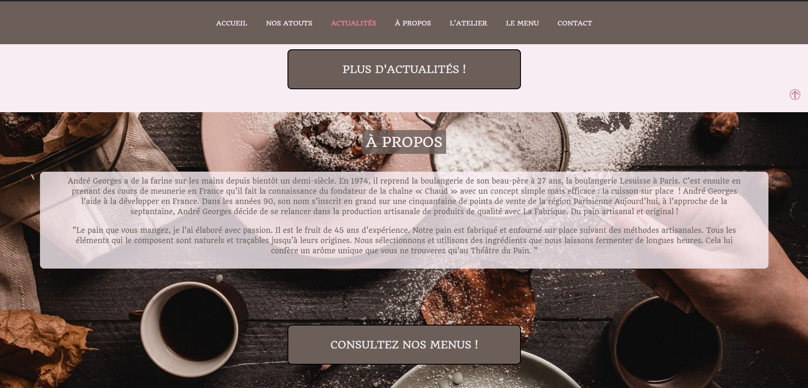

### Final result mobile

   

## Useful links

- [Simple parallax](https://codepen.io/Rueb/pen/rZbZgj)
- [How to Create a Sticky Navbar - CSS & JS](https://alvarotrigo.com/blog/sticky-navbar/)
